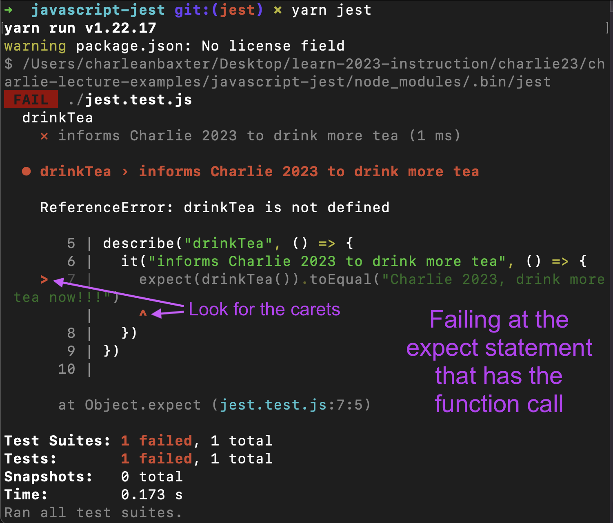
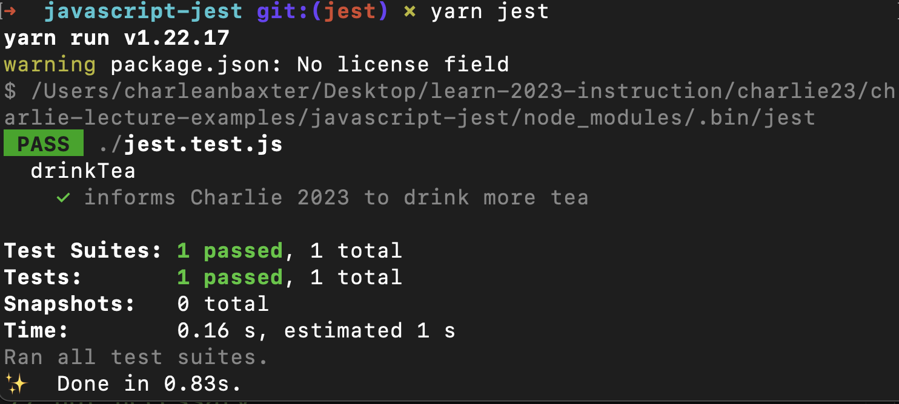
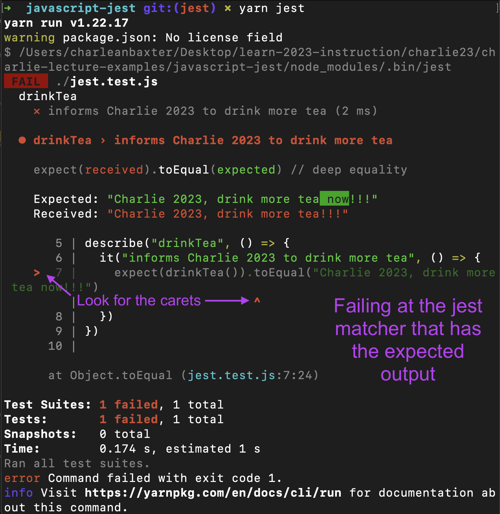

## Getting Started
- $ `cd <github-repo>`
- $ `git pull origin main`
- $ `git checkout -b <branch-name>`
- $ `mkdir <folder-name>`
- $ `cd <folder-name>`
- $ `touch jest.test.js`
- $ `code .`
- $ `yarn add jest`

***
***NOTE***
- run yarn commands on the project directory
- run git commands on the github repo

## Pushing changes to github
***cd out to the github repo***
- $ `cd ..`  

***then perform git flow as usual***
- $ `git status`
- $ `git add <folder-name>`
- $ `git commit -m "message"`
- $ `git push origin <branch-name>`

## Test Driven Development (TDD)

***Purpose***
- To identify errors  
- To give confidence in the quality of your code 

***Types***
- Unit Testing: Testing the individual components of an application
- Integration Testing: Testing how components interact with each other
- System Testing: Testing the whole application
- Acceptance Testing: Testing that the user requirement's have been met

***Three things to keep track of when testing:***
- Input: What is the value you are passing to your method or function?
- Expected output: What is supposed to happen based on your input?
- Actual result from your code: What has actually occurred from your logic?

## $${\color{red}RED - \space \color{green}GREEN - \space \color{gold}REFACTOR}$$ 

  $${\color{red} Red: \space creating \space a \space test \space for \space a \space function \space that \space will \space give \space an \space expected \space output}$$

  $${\color{red} 1. \space Write \space the \space test}$$  

  $${\color{red} \space \space \space \space 2. \space See \space the \space test \space fail}$$

  $${\color{green} Green: \space creating \space the \space function \space that \space will \space pass \space the \space evaluation}$$  

  $${\color{green} 3. \space Write \space the \space code}$$  

  $${\color{green} \space \space \space \space 4. \space See \space the \space test \space pass}$$

  $${\color{gold} Refactor: \space clean \space up \space code \space or \space use \space a \space different \space approach}$$  

  $${\color{gold} \space \space \space  \space \space \space  \space \space \space \space \space \space 5. \space Refactor \space if \space necessary}$$

## UNIT TESTING - Creating a jest test
- describe(): groups the test, takes in two arguments:  
  - string of the name of the function
  - a callback function, which is a function that is taken in as an argument

- it(): nested in the describe code block, defining the test, takes in two arguments:  
  - string of the action statement of the function 
  - a callback function

- expect(): function call with or without an argument  

- jest matcher: same lines as the expect statement, appended to the end of the expect statement
  - takes the expected output as an argument

***
$${\color{red}RED}$$
***

1. Write the test
```js
  describe("drinkTea", () => {
    it("informs Charlie 2023 to drink more tea", () => {
      expect(drinkTea()).toEqual("Charlie 2023, drink more tea now!!!")
    })
  })
```

2. See the test fail by running $ yarn jest  

  
- Good failure because the test is built to evaluate a function call drinkTea.  
- Since the function does not exist yet, this test fails at the expect statement that contains the function call.  
- Output -> ReferenceError: drinkTea is not defined

***
$${\color{green}GREEN}$$
***

3. Write the code
```js
  // Pseudocode:
  // input: none
  // output: string that states "Charlie 2023, drink more tea now!!!"
  // function name: drinkTea
  // return: "Charlie 2023, drink more tea now!!!"

  // function
  const drinkTea = () => {
    return "Charlie 2023, drink more tea now!!!"
  }
```

4. See the test pass by running $ yarn jest  

  

  - not need to console.log() the function call
  - the function call is in the expect statement
  - As long as the logic returns the same output as the expected output passed into the jest matcher, you will see PASS. If not, an error message will appear.

***
$${\color{gold}REFACTOR}$$
***

5. Refactor, if necessary  
    - not necessary for this function

***


## Unexpected failure
  

- If you receive an error when evaluating your function, follow the trace of the error.

- This error is showing that the expected output and the actual output (received) are not the same.

- Fix: correct the statement by ensuring it is exactly what is passed into the jest matcher on the expect statement line of the jest test.

